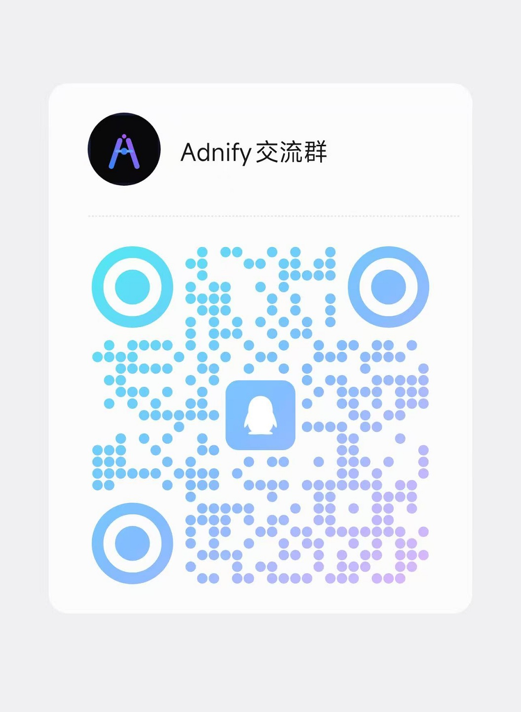

# Adnify

[中文](README.md) | **English**

> **Connect AI to Your Code.**
> A next-generation code editor with stunning visual experience and deeply integrated AI Agent.

   

Adnify is more than just an editor—it's your **intelligent programming companion**. It replicates and surpasses traditional IDE experiences, blending Cyberpunk glassmorphism design with a powerful built-in AI Agent that supports full-process automation from code generation to file operations.

<!-- Main Interface Screenshot -->


---

## Contact & Community

Join our community to discuss Adnify usage and development!

| WeChat Group | QQ Group | Author WeChat |
|:---:|:---:|:---:|
|  |  |  |
| Scan to join WeChat group | QQ Group: `1076926858` | WeChat ID: `adnaan_worker` |

> 💡 For issues or suggestions, submit them on [Gitee Issues](https://gitee.com/adnaan/adnify/issues) or [Github Issues](https://github.com/adnaan-worker/adnify/issues)

---

📋 **[View Full Changelog →](CHANGELOG.md)**

---

## Table of Contents

- [Core Features](#-core-features)
- [Unique Advantages](#-unique-advantages-vs-cursorwindsurfclaude-code)
- [Quick Start](#-quick-start)
- [Feature Details](#-feature-details)
- [Keyboard Shortcuts](#-keyboard-shortcuts)
- [Project Structure](#-project-structure)
- [Contributing](#-contributing--feedback)

---

## ✨ Core Features

### 🎨 Stunning Visual Experience

- **Multi-Theme Support**: 4 carefully designed built-in themes
  - `Adnify Dark` - Default dark theme, soft and eye-friendly
  - `Midnight` - Deep midnight blue, focused coding
  - `Cyberpunk` - Neon cyberpunk style
  - `Dawn` - Bright daytime theme

- **Glassmorphism Design**: Global frosted glass style with subtle glowing borders and dynamic shadows
- **Immersive Layout**: Frameless window, Chrome-style tabs, breadcrumb navigation


### 🤖 Deep AI Agent Integration

- **Three Working Modes**:
  - **Chat Mode** 💬: Pure conversation mode, quick Q&A, no tool calls
  - **Agent Mode** 🤖: Intelligent agent mode, single-task execution with full file system and terminal operation permissions
  - **Plan Mode** 📋: Project-level development mode, step-by-step planning with automatic task progress tracking

- **23 Built-in Tools**: Complete toolset for AI autonomous invocation
  - File Reading: `read_file`, `read_multiple_files`, `list_directory`, `get_dir_tree`
  - File Writing: `write_file`, `edit_file`, `replace_file_content`, `create_file_or_folder`, `delete_file_or_folder`
  - Search: `search_files`, `codebase_search`
  - LSP Analysis: `find_references`, `go_to_definition`, `get_hover_info`, `get_document_symbols`, `get_lint_errors`
  - Terminal: `run_command`
  - Network: `web_search`, `read_url`
  - Task Planning: `create_plan`, `update_plan` (Plan Mode exclusive)
  - UI/UX Design: `uiux_search` (Design knowledge base search)

- **Smart Context**:
  - `@filename` Reference file context
  - `@codebase` Semantic codebase search
  - `@git` Reference Git changes
  - `@terminal` Reference terminal output
  - `@symbols` Reference current file symbols
  - `@web` Web search
  - Drag & drop files/folders to chat

- **Multi-LLM Support**: OpenAI, Anthropic Claude, Google Gemini, DeepSeek, Ollama, Custom API
- **Quick Model Switching**: Dropdown selector at bottom of chat panel, grouped by provider
- **MCP Protocol Support**: Integrated Model Context Protocol for external tool extensions
- **MCP Rich Content Rendering**: Tool execution results support Markdown, images, tables, and more


### 🚀 Unique Advantages (vs Cursor/Windsurf/Claude Code)

#### 🔄 9-Strategy Smart Replace
When AI edits code, mainstream tools often fail due to whitespace and indentation differences. Adnify implements **9 fault-tolerant matching strategies**, automatically trying in priority order:
1. **Exact Match** - Completely identical
2. **Line Trim Match** - Ignore leading/trailing whitespace per line
3. **Block Anchor Match** - Anchor first/last lines + middle similarity matching
4. **Whitespace Normalization** - Normalize consecutive whitespace to single space
5. **Flexible Indentation** - Match after removing minimum common indentation
6. **Escape Normalization** - Handle `\n`, `\t` escape differences
7. **Trim Match** - Match after overall trim
8. **Context-Aware Match** - First/last line anchors + 50% middle line matching
9. **Multiple Occurrence Match** - Support replaceAll

> 💡 This means AI can successfully apply modifications even with slight format differences, dramatically improving edit success rate.

#### ⚡ Smart Parallel Tool Execution
Mainstream tools typically execute all tool calls serially. Adnify implements **dependency-aware parallel execution**:
- Automatically analyze dependencies between tools
- Independent read operations execute in parallel
- Write operations on different files can run in parallel
- Write operations on same file remain serial
- Write-after-read dependencies auto-detected

> 💡 2-5x speed improvement for multi-file operations while ensuring data consistency.

#### 🧠 4-Level Context Compression
During long conversations, mainstream tools either truncate history or error out. Adnify implements **progressive 4-level compression**:
- **L1**: Remove redundant tool results
- **L2**: Compress old messages, retain key information
- **L3**: Generate conversation summary
- **L4**: Auto-create new session + Handoff document, seamlessly continue task

> 💡 Supports truly long conversations, tasks won't interrupt due to context overflow.

#### 📸 Checkpoint System
Auto-creates file snapshots before AI modifications, supporting:
- Rollback by message granularity
- Configurable retention policy (count, time, file size)
- Project-level storage (`.adnify/sessions.json`)
- View any checkpoint's file content
- Compare changes between two checkpoints

> 💡 More granular version control than Git, one-click rollback if AI makes mistakes.

#### 🌿 Conversation Branching
Create branches from any message to explore different solutions:
- Visual branch management
- Branch rename, delete
- Quick switch between main/branches
- Preserve complete conversation history

> 💡 Like Git branches but for AI conversations, convenient for comparing different implementation approaches.

#### 🔁 Smart Loop Detection
AI sometimes falls into repetitive operation loops. Adnify implements **multi-dimensional loop detection**:
- Tool call pattern detection
- File content change tracking
- Similarity threshold judgment
- Auto-interrupt + suggestions

> 💡 Avoid token waste, timely detect and interrupt ineffective loops.

#### 🩺 Auto Error Fix
Auto-detects code errors after Agent execution:
- Call LSP for diagnostic information
- Detect compilation/syntax errors
- Auto-inject fix prompts
- Configurable on/off

> 💡 AI auto-checks after code changes, immediately fixes issues found.

#### 💾 AI Memory System
Inspired by Cursor Notepad / Claude Code Memory design:
- User manually adds project-level memories
- Full injection into context
- Support enable/disable individual memories
- Project-level storage (`.adnify/memory.json`)

> 💡 Let AI remember project-specific conventions and preferences.

#### 🎬 Streaming Edit Preview
Real-time Diff display as AI generates code:
- Incremental content updates
- Multi-file simultaneous preview
- Global state subscription
- Integrated with Composer

> 💡 No need to wait for AI to finish, preview changes as they're generated.

#### 🎭 Role-based Tools
Different roles/templates can have exclusive toolsets:
- **Mode Layering**: Chat (no tools) → Agent (core tools) → Plan (+planning tools)
- **Role Extension**: Add role-specific tools on top of mode base
- **Built-in Roles**: UI/UX Designer (`uiux_search` design knowledge base)
- **Extensible**: Register custom role tools via `registerTemplateTools`

```typescript
// Example: Add exclusive tools for uiux-designer role
registerTemplateTools('uiux-designer', { toolGroups: ['uiux'] })
```

> 💡 Let AI gain different capabilities based on role, frontend and backend developers can have different toolsets.

### 📝 Professional Code Editing

- **Monaco Editor**: Same editor core as VS Code
- **Multi-Language LSP Support**: 
  - TypeScript/JavaScript (tsserver)
  - Python (Pyright)
  - Go (gopls)
  - Rust (rust-analyzer)
  - C/C++ (clangd)
  - HTML/CSS/JSON
  - Vue (Volar)
  - Zig (zls)
  - C# (csharp-ls)
  
- **LSP Features**:
  - Intelligent completion
  - Hover info
  - Go to definition
  - Find references
  - Call hierarchy
  - Signature help
  - Code diagnostics
  - Code formatting
  - Rename symbol

- **Smart Root Detection**: Auto-detect monorepo sub-projects, start independent LSP for each
- **LSP Server Management**: Support custom install directory, one-click install missing language servers
- **AI Code Completion**: Context-based intelligent code suggestions (Ghost Text)
- **Inline Edit (Ctrl+K)**: Let AI modify selected code directly
- **Diff Preview**: Show diff comparison before AI modifies code, support accept/reject
- **Editor Context Menu**: Quick access to common operations
- **Auto Save**: Configurable auto-save functionality
- **Format on Save**: Auto-format code on save


### 🔍 Powerful Search Features

- **Quick Open (Ctrl+P)**: Fuzzy search to quickly locate files
- **Global Search (Ctrl+Shift+F)**: Support regex, case-sensitive, whole word match
- **Semantic Search**: AI Embedding-based codebase semantic search
- **Hybrid Search**: Combines semantic and keyword search, uses RRF algorithm to merge results
- **Symbol Search**: Quickly locate functions, classes, variables
- **In-File Search (Ctrl+F)**: Quick find in current file
- **Search & Replace (Ctrl+H)**: Support batch replace

### 📟 Integrated Terminal

- **True Terminal**: Complete terminal experience based on `xterm.js` + `node-pty`
- **Multi-Shell Support**: PowerShell, CMD, Git Bash, WSL, Bash, Zsh
- **Split Terminal**: Support multiple terminals side-by-side
- **Quick Scripts**: One-click run npm scripts from `package.json`
- **AI Fix**: One-click let AI analyze and fix terminal errors
- **Keyboard Shortcuts**: Ctrl+C/V copy/paste, Ctrl+Shift+C/V backup
- **WebGL Rendering**: High-performance terminal rendering


### 📂 File Management

- **Explorer**: Complete file tree view
- **Virtualized Rendering**: Support huge projects, smoothly browse 10k+ files
- **File Operations**: Create, rename, delete, copy path
- **Large File Support**: Smart detection of large files, optimized loading strategy
- **File Preview**: 
  - Markdown live preview (edit/preview/split modes)
  - Image preview
  - Plan file visualization
- **Drag & Drop**: Drag files to AI chat to add context
- **External Links**: Links in editor open in system browser

### 🔀 Git Version Control

- **Source Control Panel**: Complete Git operation interface
- **Change Management**: Stage, unstage, discard changes
- **Commit History**: View complete commit log, browse by timeline
- **Diff View**: Side-by-side file change comparison
- **Branch Management**: View and switch branches

### 🗂 Code Outline

- **Document Symbols**: Show function, class, variable structure of current file
- **Quick Navigation**: Click symbol to jump to corresponding position
- **Hierarchical Display**: Clear code structure hierarchy

### ⚠️ Problems Panel

- **Real-time Diagnostics**: Show errors and warnings in current file
- **Quick Locate**: Click problem to jump to corresponding line
- **Lint Integration**: Support ESLint and other code checking tools

### 🔐 Security Features

- **Workspace Isolation**: Strict workspace boundary checking
- **Sensitive Path Protection**: Block access to system sensitive directories
- **Command Whitelist**: Limit executable shell commands
- **Git Subcommand Whitelist**: Limit executable Git operations
- **Audit Log**: Record all sensitive operations (stored per workspace in `.adnify/audit.log`)
- **Permission Confirmation**: Dangerous operations require user confirmation
- **Security Settings Panel**: Customizable security policies

### 🎯 Other Features

- **Command Palette (Ctrl+Shift+O)**: Quickly execute various commands
- **Multi-Window Support**: Open multiple projects simultaneously
- **Multi-Workspace Support**: Open multiple project roots in single window
- **Workspace Restore**: Auto-remember last working state
- **Welcome Page**: Show welcome page in empty window, quickly open recent projects
- **Session Management**: Save and restore AI conversation history
- **Token Statistics**: Real-time display of conversation token consumption, configurable context limits
- **Internationalization**: Complete Chinese and English support
- **Custom Shortcuts**: Configurable keyboard bindings
- **Onboarding Wizard**: Configuration guide for first-time use with beautiful animations
- **Tree-sitter Parsing**: Support syntax tree parsing for 20+ languages

---

## 🚀 Quick Start

### Requirements

- Node.js >= 18
- Git
- Python (optional, for compiling certain npm packages)

### Development Environment

```bash
# 1. Clone project
git clone https://gitee.com/adnaan/adnify.git
cd adnify

# 2. Install dependencies
npm install

# 3. Start dev server
npm run dev
```

### Build & Package

```bash
# 1. Generate icon resources (first run or when icons change)
node scripts/generate-icons.js

# 2. Build installer
npm run dist

# Generated files in release/ directory
```

---

## 📖 Feature Details

### Configure AI Model

1. Click **Settings** icon in bottom-left or press `Ctrl+,`
2. Select AI provider in **Provider** tab
3. Enter API Key (local models like Ollama need Base URL)
4. Select model and save

Supported providers:
- OpenAI (GPT-4, GPT-4o, GPT-4o-mini, GPT-3.5)
- Anthropic (Claude 3.5 Sonnet, Claude 3 Opus/Sonnet/Haiku)
- Google (Gemini 2.0 Flash, Gemini 1.5 Pro/Flash)
- DeepSeek (DeepSeek Chat, DeepSeek Coder)
- Ollama (local models)
- Custom OpenAI-compatible API
- Support custom model names

### Collaborate with AI

**Reference File Context:**
- Type `@` to show file selection list
- Drag files from sidebar to input box
- Use slash command `/file` to select files

**Slash Commands:**
- `/file` - Add file to context
- `/clear` - Clear conversation
- `/plan` - Switch to Plan mode and create task plan
- `/chat` - Switch to Chat mode
- `/agent` - Switch to Agent mode
- More commands available by typing `/` in input box

**@ Context References:**
- `@filename` - Add file to context
- `@codebase` - Enable semantic search
- `@git` - Reference Git changes
- `@terminal` - Reference terminal output
- `@symbols` - Reference current file symbols
- `@web` - Enable web search

**Let AI Modify Code:**
1. Switch to **Agent Mode**
2. Enter instruction (e.g., "Refactor this function, add error handling")
3. AI generates Diff preview
4. Click "Accept" to apply changes, or "Reject" to decline

**Inline Edit:**
1. Select code
2. Press `Ctrl+K`
3. Enter modification instruction
4. Preview and apply

**AI Custom Instructions:**
In Settings → Agent, you can add custom instructions that AI will follow in every conversation.

### Codebase Indexing

Enable semantic search functionality:

1. Open Settings → **Index** tab
2. Select Embedding provider (Jina, Voyage, OpenAI, etc.)
3. Configure API Key
4. Click "Start Indexing" to begin

After indexing completes, AI can use `codebase_search` tool for semantic search.

Supported Embedding providers:
- Jina AI (recommended, free tier available)
- Voyage AI
- OpenAI
- Custom API (support any compatible API)

### Using Plan Mode

Plan Mode is suitable for complex project-level development tasks:

1. Switch to **Plan Mode** (click mode toggle button or type `/plan`)
2. Describe your task goal
3. AI will auto-create step-by-step plan
4. AI executes plan step-by-step, auto-updates progress
5. View plan status and progress anytime

Plan Mode exclusive features:
- Auto task decomposition
- Progress tracking
- Step status management
- Plan visualization preview

### Using Git

1. Click **Source Control** icon in sidebar
2. View file change list
3. Click `+` to stage files
4. Enter commit message
5. Press `Ctrl+Enter` to commit

---

## ⌨️ Keyboard Shortcuts

### General

| Shortcut | Function |
|:---|:---|
| `Ctrl + P` | Quick open file |
| `Ctrl + Shift + P` | Command palette |
| `Ctrl + ,` | Open settings |
| `Ctrl + \`` | Toggle terminal |
| `Ctrl + B` | Toggle sidebar |
| `Ctrl + J` | Toggle bottom panel |
| `Ctrl + Shift + ?` | Keyboard shortcuts help |
| `F12` | Developer tools |

### Editor

| Shortcut | Function |
|:---|:---|
| `Ctrl + S` | Save file |
| `Ctrl + W` | Close current tab |
| `Ctrl + Z` | Undo |
| `Ctrl + Shift + Z` | Redo |
| `Ctrl + D` | Select next match |
| `Ctrl + /` | Toggle comment |
| `Ctrl + Shift + K` | Delete line |
| `Ctrl + K` | Inline AI edit |
| `F12` | Go to definition |
| `Shift + F12` | Find references |
| `Ctrl + Space` | Trigger completion |

### Search

| Shortcut | Function |
|:---|:---|
| `Ctrl + F` | In-file search |
| `Ctrl + H` | In-file replace |
| `Ctrl + Shift + F` | Global search |

### Terminal

| Shortcut | Function |
|:---|:---|
| `Ctrl + C` | Copy selection / Interrupt command |
| `Ctrl + V` | Paste |
| `Ctrl + Shift + C` | Copy (backup) |
| `Ctrl + Shift + V` | Paste (backup) |

### AI Chat

| Shortcut | Function |
|:---|:---|
| `Enter` | Send message |
| `Shift + Enter` | New line |
| `@` | Reference file/context |
| `/` | Slash commands |
| `Escape` | Stop generation |

### Mode Switching

| Mode | Description |
|:---|:---|
| Chat 💬 | Pure conversation, no tool calls |
| Agent 🤖 | Single task, tool calls |
| Plan 📋 | Project-level development, step-by-step planning |

---

## 📂 Project Structure

```
adnify/
├── resources/           # Icon resources
├── scripts/             # Build scripts
├── src/
│   ├── main/            # Electron main process
│   │   ├── ipc/         # IPC handlers
│   │   │   ├── http.ts      # HTTP requests
│   │   │   ├── indexing.ts  # Code indexing
│   │   │   ├── llm.ts       # LLM communication
│   │   │   ├── lsp.ts       # LSP service
│   │   │   ├── search.ts    # Search functionality
│   │   │   └── settings.ts  # Settings management
│   │   ├── indexing/    # Codebase indexing service
│   │   │   ├── chunker.ts       # Code chunking
│   │   │   ├── embedder.ts      # Embedding generation
│   │   │   ├── indexService.ts  # Index service
│   │   │   └── vectorStore.ts   # Vector storage
│   │   ├── services/llm/# LLM communication layer
│   │   └── security/    # Security module
│   │       ├── securityModule.ts    # Security manager
│   │       ├── secureTerminal.ts    # Terminal security
│   │       └── workspaceHandlers.ts # Workspace handlers
│   ├── renderer/        # Frontend render process
│   │   ├── agent/       # AI Agent core
│   │   │   ├── llm/     # LLM client adapters
│   │   │   ├── tools/   # Tool definitions & execution
│   │   │   ├── services/# Agent services
│   │   │   └── prompts/ # Prompt templates
│   │   ├── components/  # UI components
│   │   │   ├── agent/   # Agent-related components
│   │   │   │   ├── ChatPanel.tsx      # Chat panel
│   │   │   │   ├── ToolCallCard.tsx   # Tool call card
│   │   │   │   ├── InlineDiffPreview.tsx # Diff preview
│   │   │   │   └── PlanPreview.tsx    # Plan preview
│   │   │   ├── editor/  # Editor components
│   │   │   │   ├── Editor.tsx         # Monaco editor
│   │   │   │   ├── DiffViewer.tsx     # Diff viewer
│   │   │   │   └── InlineEdit.tsx     # Inline edit
│   │   │   ├── sidebar/ # Sidebar components
│   │   │   │   └── panels/
│   │   │   │       ├── ExplorerView.tsx  # File explorer
│   │   │   │       ├── SearchView.tsx    # Search panel
│   │   │   │       ├── GitView.tsx       # Git panel
│   │   │   │       ├── OutlineView.tsx   # Outline view
│   │   │   │       └── ProblemsView.tsx  # Problems panel
│   │   │   ├── panels/  # Bottom panels
│   │   │   │   ├── TerminalPanel.tsx  # Terminal panel
│   │   │   │   ├── SessionList.tsx    # Session list
│   │   │   │   └── CheckpointPanel.tsx# Checkpoint panel
│   │   │   ├── dialogs/ # Dialogs
│   │   │   │   ├── CommandPalette.tsx # Command palette
│   │   │   │   ├── QuickOpen.tsx      # Quick open
│   │   │   │   └── OnboardingWizard.tsx # Onboarding wizard
│   │   │   └── settings/# Settings components
│   │   ├── services/    # Frontend services
│   │   │   └── TerminalManager.ts # Terminal manager
│   │   ├── store/       # Zustand state management
│   │   └── i18n/        # Internationalization
│   └── shared/          # Shared code
│       ├── config/      # Configuration definitions
│       │   ├── providers.ts # LLM provider configs
│       │   └── tools.ts     # Unified tool configs
│       ├── constants/   # Constants
│       └── types/       # Type definitions
└── package.json
```

---

## 🛠 Tech Stack

- **Framework**: Electron 39 + React 18 + TypeScript 5
- **Build**: Vite 6 + electron-builder
- **Editor**: Monaco Editor
- **Terminal**: xterm.js + node-pty + WebGL Addon
- **State Management**: Zustand
- **Styling**: Tailwind CSS
- **LSP**: typescript-language-server
- **Git**: dugite
- **Vector Storage**: LanceDB (high-performance vector database)
- **Code Parsing**: tree-sitter
- **Validation**: Zod

---

## 🤝 Contributing & Feedback

Issues and Pull Requests are welcome!

If you like this project, please give it a ⭐️ Star!

---

## 📄 License

This project uses a custom license with main terms:

- ✅ Allowed for personal learning, research, non-commercial use
- ✅ Allowed to modify and distribute (must retain copyright info)
- ⚠️ **Commercial use requires written authorization from author**
- ❌ Prohibited to remove software name, author copyright, repository address, etc.

For commercial licensing, contact: adnaan.worker@gmail.com

See [LICENSE](LICENSE) file for details

---

## 🙋 Q&A: About the License

**Q: Why so many requirements in your license? Looks more complex than MIT?**

A: Because I've been hurt before 😭

Seriously, I've seen too many of these operations:
- Fork an open-source project, change the name and skin, claim it's "independently developed"
- Delete author info and repo address completely, as if the code appeared from nowhere
- Sell it for money, take outsourcing projects, don't give the original author a penny, won't even give a star
- Even worse, some use it as training materials, students think the teacher wrote it

I'm not against commercialization, really. Want to use it commercially? Come on, send an email, maybe we can even collaborate. But sneakily erasing my name to make money? That's too much, right?

**Q: Will I accidentally violate the rules if I use it for personal learning?**

A: No! Personal learning, research, graduation projects, side projects—use it freely! As long as you:
1. Don't delete my name and repo address
2. Don't sell it for money
3. If you build something new based on it, just say "Based on Adnify"

That simple, I'm not trying to make things difficult 😊

**Q: If I want to use it internally at my company, does that count as commercial use?**

A: If it's an internal company tool, not sold externally, doesn't generate direct revenue, generally doesn't count. But if unsure, send me an email, I'm easy to talk to (really).

**Q: Why not just use GPL?**

A: GPL is a good license, but it can't stop "deleting author info" operations. My license core is one thing: **You can use it, modify it, distribute it, but don't pretend you wrote it**.

Simply put, open source isn't "free for you to abuse," it's "I'm willing to share, but please respect my work."

If you agree with this philosophy, welcome to star ⭐️, that's more important than anything.
